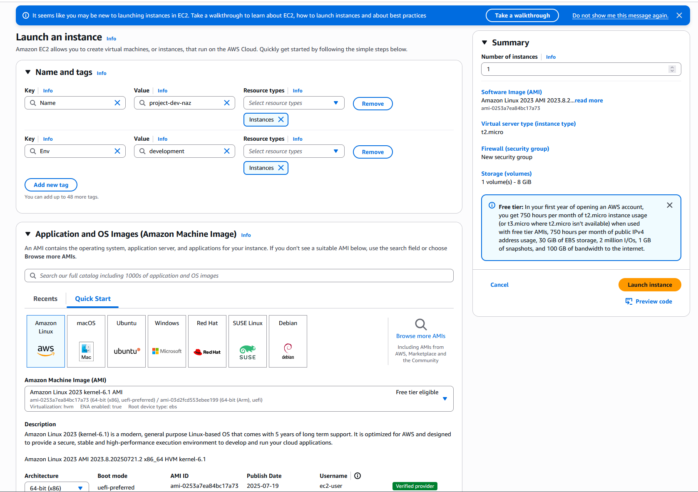
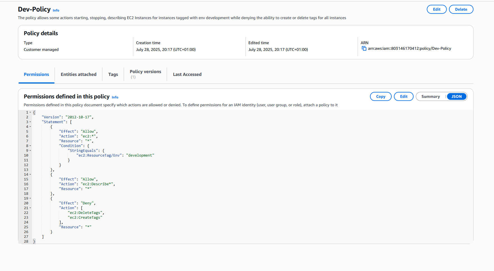
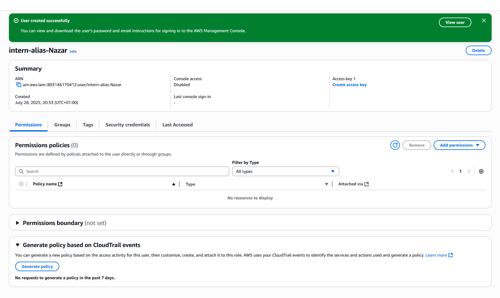
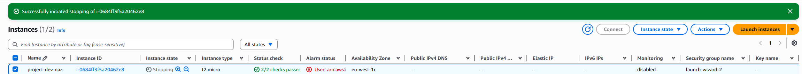
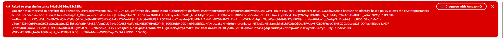

# Securing AWS EC2 Access for Interns with IAM

In many companies, interns need access to development resources but must be kept far away from production systems.  
In this project, I set up an **AWS IAM security model** that enforces exactly that — interns can manage development EC2 instances, but production stays completely locked down.

---

## The Challenge
Imagine giving a junior intern full AWS permissions.  
It’s like giving your car keys to someone who just learned to drive — in the dark — on ice.  
Not a great idea.

The goal was simple:
- Allow interns to start, stop, and view **development** EC2 instances.
- Block any interaction with **production** instances.
- Prevent them from creating or deleting tags (which could hide what’s prod vs dev).

---

## My Steps

**1. Using Tags for Environment Separation**  
I tagged EC2 instances with an `Environment` key:
- `production` for live systems.
- `development` for developing machines.

This tag became the anchor for all permission rules.  

---

**2. Writing a Custom IAM Policy**  
Instead of using AWS’s pre-made policies, I wrote my own in JSON.  
It says:  
- **Effect: Allow** → Start, stop, and describe EC2 **only** if `Environment=development`.  
- **Effect: Deny** → Create or delete tags for any instance.  

  
[View full JSON policy](policy/dev-ec2-policy.json)

---

**3. Making AWS Logins Friendlier**  
I set up an **Account Alias** so users could log in with a name instead of a random 12-digit ID.  

---

**4. Creating the Interns Group**  
I made an `Interns` IAM group, attached the policy, and added new IAM users.  
From now on, anyone in that group inherits the least-privilege rules.  

---

**5. Testing the Setup**  
When logged in as an intern:
- Stopping a **development** instance → Works fine.  
  
- Stopping a **production** instance → Blocked by AccessDenied.  
  

It’s a simple setup, but in a real company, this could prevent an expensive outage.

---

## What I Learned
- How to **control AWS access by tags**, not just by service.
- Why **custom IAM policies** give more control than AWS defaults.
- That even in small environments, **least privilege** matters.

---

**Author:** Nazar Buryak  
[LinkedIn](https://linkedin.com/in/yourprofile) | [GitHub](https://github.com/yourprofile)
